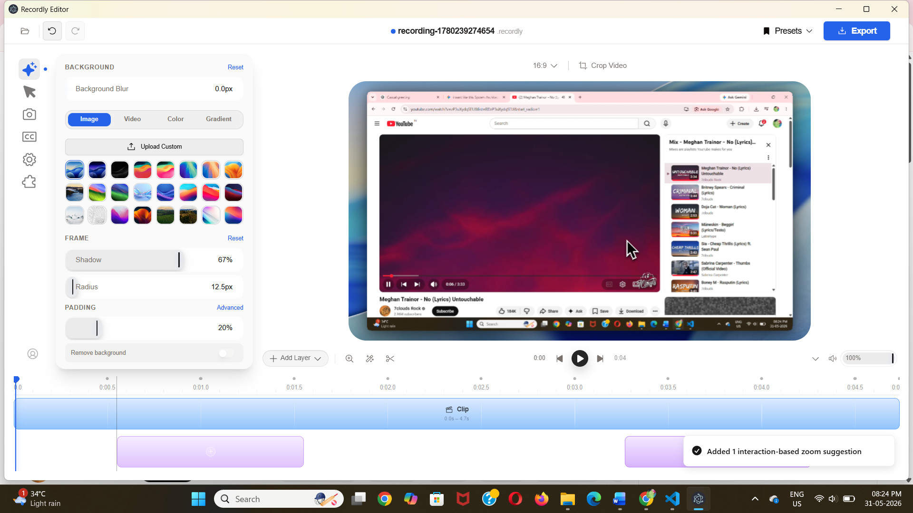

# 📒 Recordly

## 🚀 About the Project
Recordly is a simple and efficient web-based record management system built using HTML, CSS, and JavaScript. It helps users manage and organize records in a clean and user-friendly interface.

---

## 🛠️ Tech Stack
- HTML
- CSS
- JavaScript

---

## 📸 Screenshots

### Home Page

### Homepage View

---

## ✨ Features
- Add new records
- View records easily
- Export or manage data
- Simple and clean UI
- Beginner-friendly project

---

## 🎯 Project Purpose
This project was created to practice frontend development skills and understand how HTML, CSS, and JavaScript work together in real applications.

---

## 👩‍💻 Developer
Created by Sakshi

---

## 📌 Note
If images are not visible:
- Ensure `home.png` and `homepage.png` are uploaded in the same repository
- File names must match exactly (case-sensitive)
